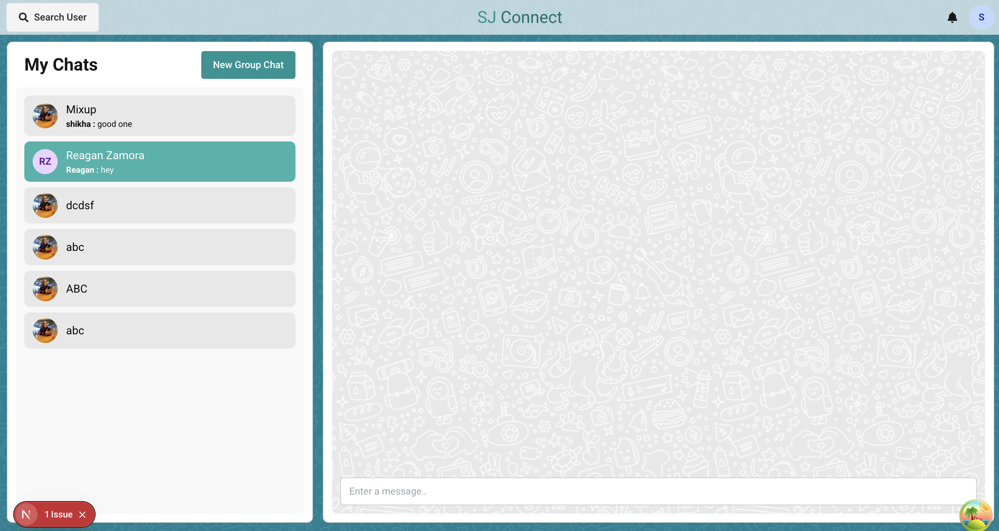

# Chat Application — Frontend

## Overview

A **real-time chat application frontend** built with modern web technologies. This frontend connects to a backend server for messaging and user management.

- **Backend Repository**: [https://github.com/Shikha115/chat-application-backend](https://github.com/Shikha115/chat-application-backend)
- **Frontend Repository**: [https://github.com/Shikha115/chat-application-frontend](https://github.com/Shikha115/chat-application-frontend)

## Features

- **Real-time Messaging**: Instant message delivery using WebSockets via Socket.IO.
- **User Authentication**: Secure login and registration.
- **Group Chats**: Create and manage group conversations.
- **Responsive Design**: Optimized for desktop and mobile devices.
- **Notifications**: Real-time badges for unread messages.

## Tech Stack

- **Next.js**: React framework for SSR and routing.
- **TypeScript**: Typed JavaScript.
- **Chakra UI**: Component library.
- **SCSS**: Styling preprocessor.
- **Zustand**: State management.
- **Socket.IO Client**: Real-time communication.
- **Axios**: HTTP client.

## Installation

1. **Clone the repository**:

   ```bash
   git clone https://github.com/Shikha115/chat-application-frontend.git
   cd chat-application-frontend
   ```

2. **Install dependencies**:
   ```bash
   npm install
   ```

## Environment Setup

Create `.env.local` and set:

```env
NEXT_PUBLIC_API_URL=http://localhost:8080
```

## Running the Application

### Development

```bash
npm run dev
```

App runs at [http://localhost:3000](http://localhost:3000).

### Production

```bash
npm run build
npm start
```

## Contributing

1. Fork the repo.
2. Create a feature branch.
3. Commit changes.
4. Open a Pull Request.

## Sneak a Look


## License

MIT License. See [LICENSE](../LICENSE) file.
